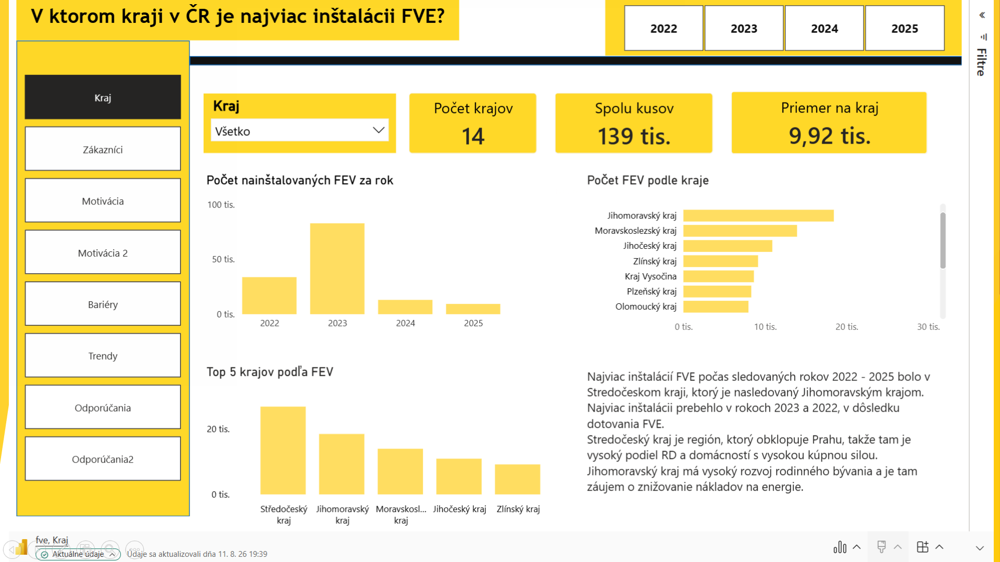
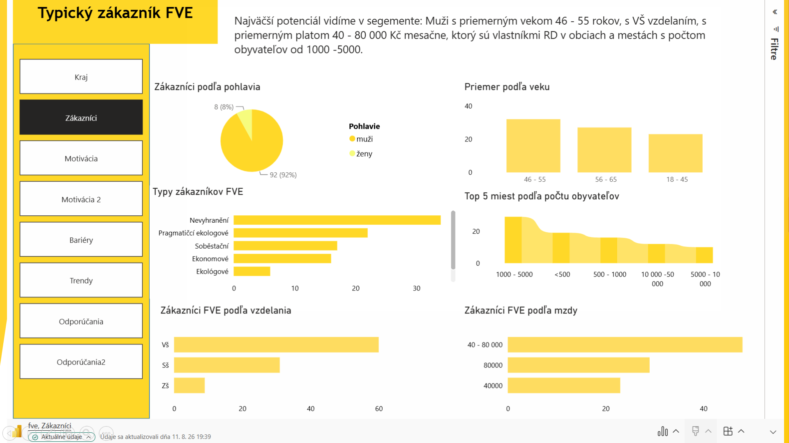
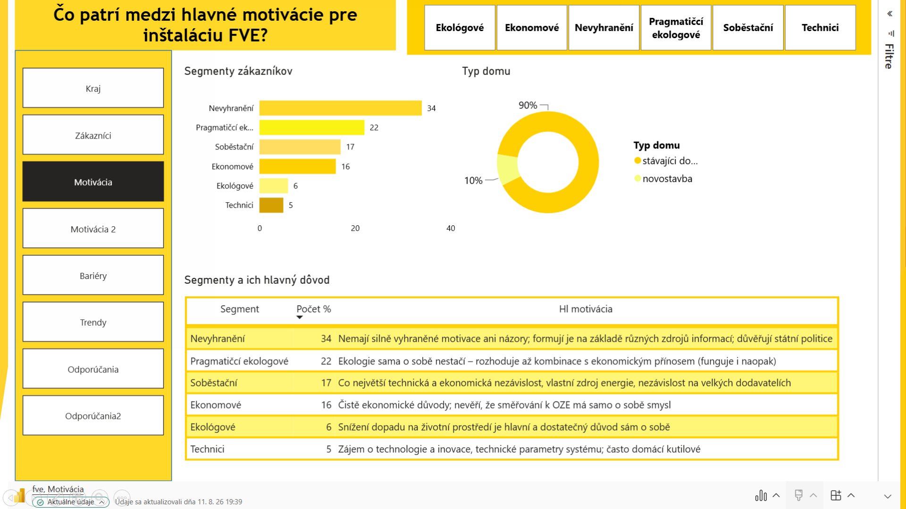
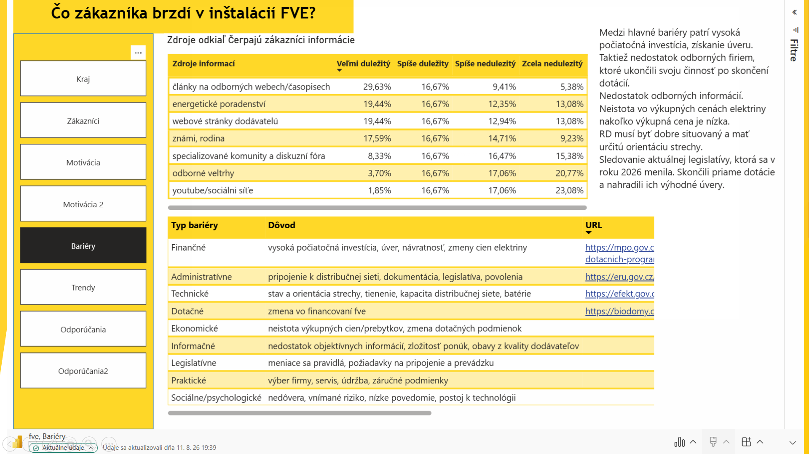
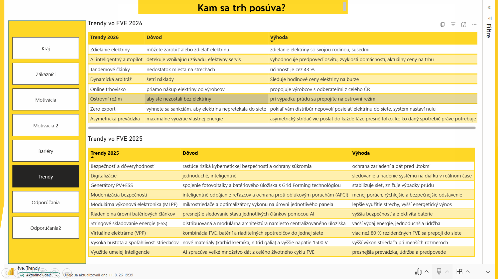
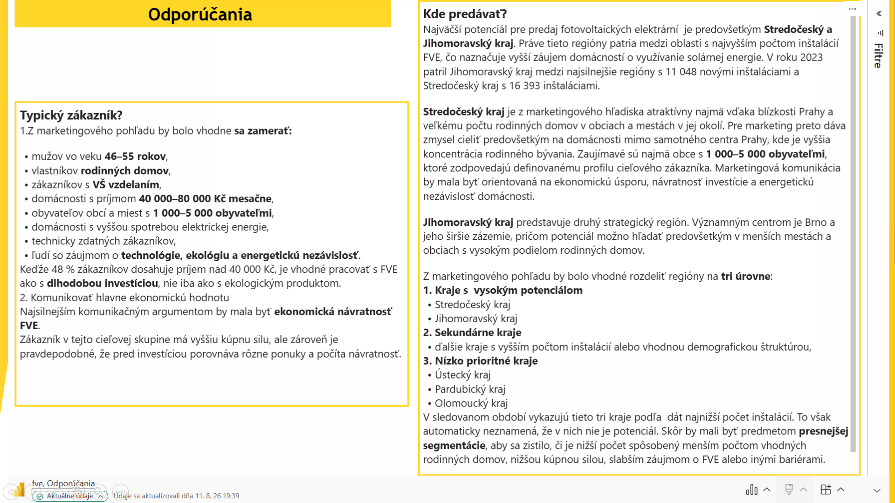
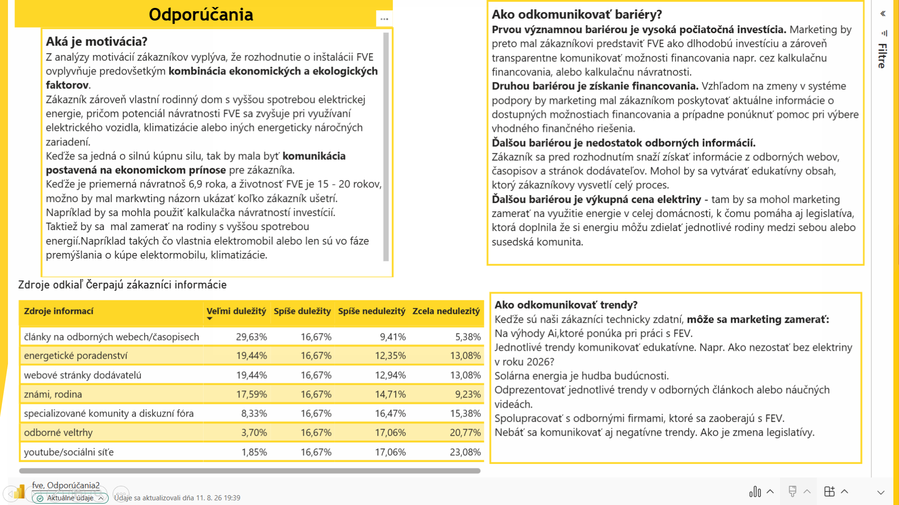

# Photovoltaics-CZ-analytics
Dashboard o vývoji fotovoaltiky v ČR v Power BI. Dáta boli získané z verejných zdrojov, ktoré poskytovali verejné informácie o inštaláciách FVE.

This dashboard regarding photovoltaics in the Czech Republic was created using Power BI. The data comes from public sources that collect information on installations in the Czech Republic.The data was first compiled in Excel and subsequently processed in Power BI.

## 1. Project Title / Headline

Jednalo sa o projekt domáce fotovoltaické elektrárne v Českej republike. V rámci projektu bolo hlavnou úlohou pripraviť podklady pre marketingové oddelenie, ktoré zvažuje rozvoj aktivít v oblasti domácich fotovoltaických elektrárien. 

The project concerned residential photovoltaic power plants in the Czech Republic. The main task was to prepare background materials for the marketing department, which is considering expanding its activities in the field of residential photovoltaic power plants.

## 2. Short Description / Purpose

Na základe verejne dostupných zdrojov bolo treba pripraviť analýzu zameranú na jednotlivé oblasti:
1. Kto je typický zákazník, ktorý si plánuje inštaláciu FVE.
2. Aká je súčasná veľkosť penetrácie trhu v ČR.
3. Aké sú hlavné motivácie a bariéry pre inštaláciu FVE.
4. Aké trendy v tejto oblasti môžeme očakávať.
5. Aké faktory ovplyvňujú rozhodovanie zákazníka.

Based on publicly available sources, an analysis needed to be prepared focusing on the following areas:
1. Who is the typical customer planning a photovoltaic FVE system installation?
2. What is the current level of market penetration in the Czech Republic?
3. What are the main motivations and barriers regarding PV system installation?
4. What trends can be expected in this sector?
5. What factors influence customer decision-making?

## 3. Tech Stack

Dashboard bol vytvorený pomocou nasledujúcich nástrojov:

📊 Power BI Desktop – Tvorba a vizualizácia dashboardov
📂 Power Query – Transformácia dát v Power BI
🧠 DAX - tvorba metrík na vypočítanie priemerov
📂 Excel - tvorba tabuliek
📁 File Format – .pbix (Power BI), .png (obrázky dashboardov).

The dashboard was created using the following tools:

📊 Power BI Desktop – Dashboard creation and visualization
📂 Power Query – Data transformation in Power BI
🧠 DAX – Creating metrics to calculate averages
📂 Excel – Creating tables
📁 File Format – .pbix (Power BI), .png (dashboard images).

## 4. Data Source

Dáta boli zbierané z verejne dostupných zdrojov, ktoré uverejňovali ročné štatistiky inštalácií FVE a z výskumých štúdií.

Dáta obsahovali:
- geografické informácie
- základné informácie o zákazníkoch (vek, pohlavie, mzda, vzdelanie)
- trendy v roku 2025 a 2026
- motivácie zákazníkov

The data were collected from publicly available sources publishing annual statistics on FVE system installations, as well as from research studies.

The data included:
- geographic information
- basic customer information (age, gender, income, education)
- trends for 2025 and 2026
- customer motivations
## 5. Features / Highlights

Vymedzenie problému:

Údaje o FVE sú rozptýlené a z viacerých zdrojov čo sťažuje rýchlu identifikáciu problémov. Dáta neboli zoskupené v tabuľkách, čo spôsobovalo predlžovanie spracovania údajov. 

Cieľom dashboardu:

1. Poskytnúť marketingovému oddeleniu cenné informácie, ktoré by vedeli aplikovať v ďalšom procese rozhodovania. 
2. Porovnať priemerné náklady na FVE aby si zákazník vedel spraviť predstavu v rámci ekonomického hľadiska.
3. Porovnať jednotlivé roky v rámci trendov, aby sa poukázalo na inovácie vo vývoji FVE.
4. Vizualizovať jednotlivé kraje a počty inštalácií v rámci ČR.
5. Poskytnúť informácie o typickom zákazníkovi FVE.

Problem Definition:

Data regarding FVE systems is scattered across multiple sources, making it difficult to quickly identify issues. The lack of tabular data organization resulted in prolonged data processing times.

Dashboard Objectives:

1. Provide the marketing department with valuable insights that can be applied to future decision-making processes.
2. Compare average FVE system costs to give customers an idea of ​​the economic aspects.
3. Compare trends across different years to highlight innovations in FVE system development.
4. Visualize the distribution of installations across the regions of the Czech Republic.
5. Provide information on the typical FVE system customer.

## 6. Screenshots 

